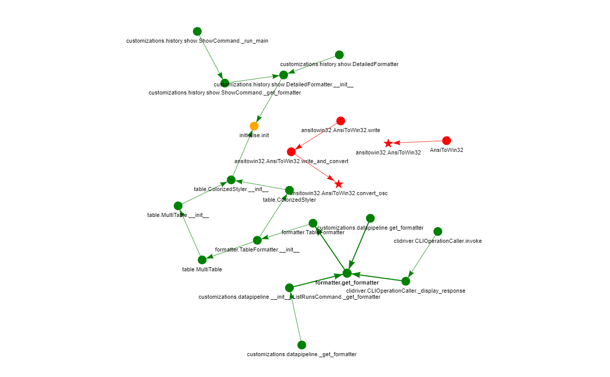

# Welcome to upgradvisor website!

## What is upgradvisor?

Upgradvisor, a fusion of “upgrade” and “advisor”, is a research project from Columbia University’s RCS lab doing exactly that. Our goal is to provide meaningful information for developers on how to upgrade their software dependencies. Our work employs static and dynamic analysis to study the change made to the dependency code and deduce the effects on the dependent code.

## Example

This example shows an upgrade opportunity for [aws-cli](https://github.com/aws/aws-cli/) version 1.21.8.
Initially, this project specified `'colorama>=0.2.5,<0.4.4'` as one of its dependencies. At the time, version 0.4.4 already existed for `colorama` which was blocked from use by this condition, and instead, version 0.4.3 was the last version available for use.

Using upgradvisor, we performed a dedicated analysis of the difference between `colorama` versions 0.4.3 and 0.4.4, as used by `aws-cli`. This analysis indicated that the changes between 0.4.3 and 0.4.4 did not impact `aws-cli`. The graph below shows the dependency path of `aws-cli` relative to `colorama`. 

Each node in the graph indicates a python method (with some exceptions). `aws-cli` code is shown in green, and the code calling `colorama` is shown in orange. Changes between version 0.4.3 and 0.4.4 are shown as starred.

From the attached graph, we can see that aws-cli only calls colorama's `initialise` method, which itself has no changes between 0.4.3 and 0.4.4.
Based on the graph, we can see that the changes between 0.4.3 and 0.4.4 are restricted to the AnsiToWin32.py class, and, excluding a change to formally recognize \x07 as BEL, are changes to the OSC regex. The changes to the regex were made solely to prevent a catastrophic backtracking bug.

## More Examples?

You can see all the pull requests made as a part of our project by exploring the repositories in our [organization's main page](https://github.com/upgradvisor).

## Roadmap and Public availability 

We are hard at work developing a bot that will allow every open-source project on GitHub to use our system!

## Contact

Want to help or know more? Feel free to reach out to Yaniv - [@YanivDa](https://twitter.com/YanivDa) on Twitter or yaniv.david@columbia.edu.
